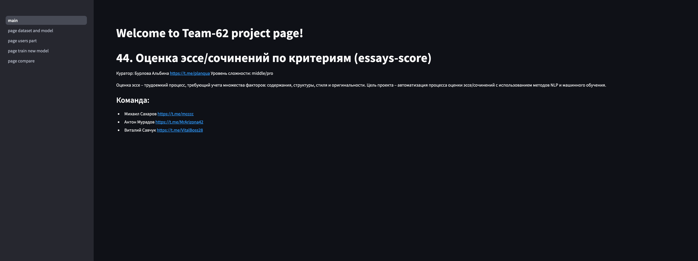
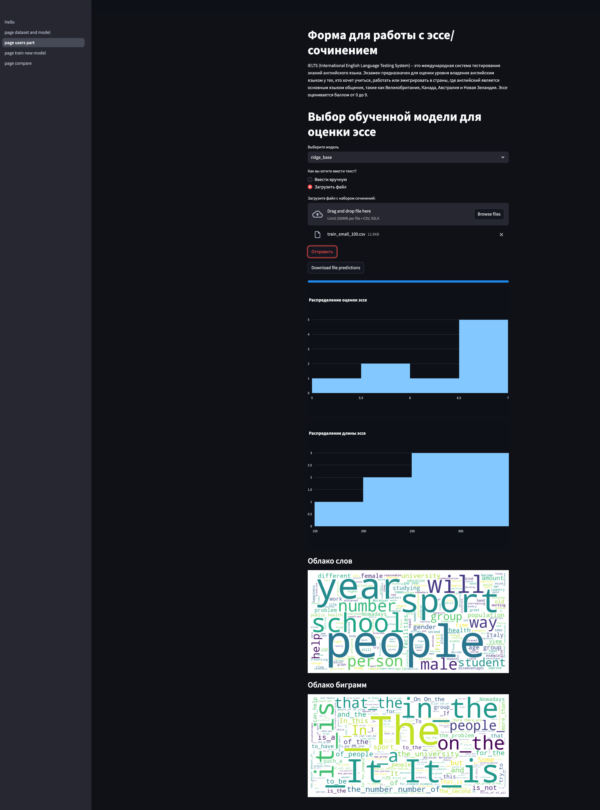
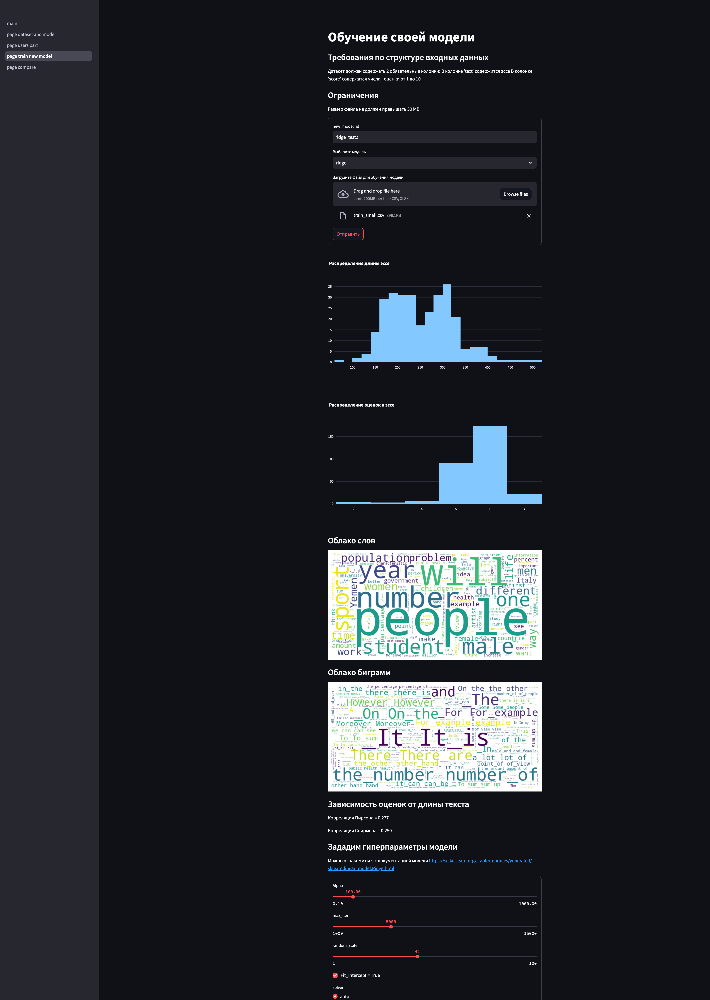

# Учебный проект Essays Scoring

[report.md](report.md)

Предсказание оценки за эссе.

Мы разрабатываем приложение - ML-сервис для помощи людям, изучающим английский язык. Один из аспектов изучения языка, будь вы native-speaker или нет, является написание эссе. Наше приложение может помочь оценить свои способности в этом искусстве.

Текущая версия приложения обучена для предсказания оценки на двух датасетах: 
1) IELTS Writing экзамен. IELTS Writing - это один из 4 экзаменов в системе оценки владения английским языком IELTS. По статистике задание Writing считается самой сложной частью IELTS. Мы надеемся, что получение фидбэка о своих эссе поможет готовящимся сдавать этот непростой экзамен.
2) Датасет из соревнования с Kaggle [Automated Essay Scoring 2.0](https://www.kaggle.com/competitions/learning-agency-lab-automated-essay-scoring-2/overview). В этом соревновании участникам предлагается предсказать оценку за эссе на основе текста эссе. В датасете только текст и оценка.

В приложении реализованы следующие регрессоры для предсказания оценки:
1) Регрессор Ridge + Bert embeddings обученный на IELTS Writing экзамен.
2) Регрессоры Logreg, SVR + Word2Vec embeddings обученный на датасете с Kaggle Automated Essay Scoring 2.0

Используя эти регрессоры можно обучать новые модели на новых датасетах, указываю кастомные гиперпараметры. И отслеживать кривые обучения по learning_curve с метрикой RMSE. 

Также ведется работа по другим добавлению других регрессоров и работа по добавлению новых датасетов в обучающую выборку. 

В Github создана организация, в которой мы создавали репозитории: 

https://github.com/hse-ai-yp24-team62/

## Команда:
- Михаил Сахаров https://t.me/mcccc
- Антон Мурадов https://t.me/MrArizona42
- Виталий Савчук https://t.meVitalBoss28


## Репозитории:
- ds-ml исследования: https://github.com/hse-ai-yp24-team62/essays-score
- app (fastapi): https://github.com/hse-ai-yp24-team62/essays-score-api
- streamlit: https://github.com/hse-ai-yp24-team62/essays-score-streamlit

## Данные

- Realec IELTS: https://realec.org/
- Kaggle IELTS: https://www.kaggle.com/datasets/mazlumi/ielts-writing-scored-essays-dataset/data
- Kaggle The Hewlett Foundation: Automated Essay Scoring: https://www.kaggle.com/competitions/asap-aes
- Kaggle Learning Agency Lab - Automated Essay Scoring 2.0: https://www.kaggle.com/competitions/learning-agency-lab-automated-essay-scoring-2/overview

## EDA

- EDA Ielts датасетов Realec и IELTS Kaggle: https://github.com/hse-ai-yp24-team62/essays-score/tree/main/eda_ielts
- EDA Kaggle датасетов: https://github.com/hse-ai-yp24-team62/essays-score/tree/main/eda_kaggle
- EDA датасетов CoNLL, JFLEG, WI-LOCNESS, BEA-19: https://github.com/hse-ai-yp24-team62/essays-score/tree/eda/other_data

## Models & Features research

- IELTS Realec & Kaggle: https://github.com/hse-ai-yp24-team62/essays-score/tree/main/ml_inference_ielts
- Kaggle датасеты: https://github.com/hse-ai-yp24-team62/essays-score/tree/baseline_kaggle_learning_lab/eda_kaggle

## Backend

- app (fastapi): https://github.com/hse-ai-yp24-team62/essays-score-api
- http://185.21.14.55:80/ - запущен на VPS

Кратко, АПИ делает следующее: 
- выдает предсказание оценки по переданному тексту
- обучает новую модель по переданному датасету и гиперпараметрам на основе предустановленных пайплайнов
- выдает список всех моделей

Подробное описание АПИ и его ручек тут: https://github.com/hse-ai-yp24-team62/essays-score-api/blob/main/readme.md

## Frontend

- streamlit: https://github.com/hse-ai-yp24-team62/essays-score-streamlit
- http://185.21.14.55:8080/ - запущен на VPS
- TG-bot: TBD

Фронтенд (стримлит) делает следующее:
- предсказание оценки по тексту (через апи)
- обучение модели по датасету (через апи)
- отрисовка EDA по датасету 

## Инструкция по запуску

**Пререквизиты**:

- Ubuntu 22.04

- Docker Engine on Ubuntu

https://docs.docker.com/engine/install/ubuntu/

- NVIDIA Container Toolkit

https://docs.nvidia.com/datacenter/cloud-native/container-toolkit/latest/install-guide.html

**Создаем папку проекта, например '/project'**

**Клонируем репозитории в '/project':**

- https://github.com/hse-ai-yp24-team62/essays-score-api

- https://github.com/hse-ai-yp24-team62/essays-score-streamlit

**Копируем docker-compose.yml из essays-score-api наружу в общую папку проекта**

**Запускаем!:**

```
sudo docker-compose up --build
```

## Демонстрация работы сервиса

Главная страница:


Предсказание оценки за эссе:


Обучение новой модели:



